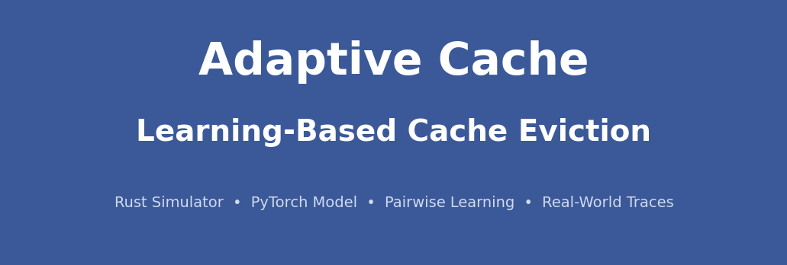
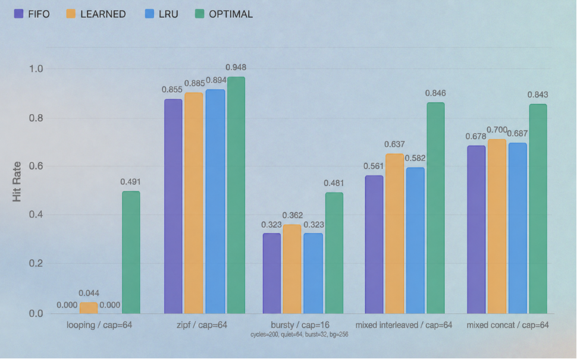

<p align="center">
  
</p>

<p align="center">
  <a href="https://www.rust-lang.org/"></a>
  <a href="https://www.python.org/"></a>
  <a href="https://pytorch.org/"></a>
</p>

<p align="center">
  <a href="https://github.com/CornellDataScience/adaptive-cache">Official Team Repository →</a>
</p>

---

## Overview

Adaptive Cache is an end-to-end research system inspired by YouTube's HALP that replaces hand-crafted cache eviction heuristics with a learned pairwise model. A high-performance Rust simulator generates training data by replaying real-world Wikipedia access traces under Belady's optimal oracle, a PyTorch MLP is trained offline to rank eviction candidates, and the resulting policy is deployed back into the simulator for head-to-head comparison against LRU, FIFO, and Belady. **The team MLP matched or exceeded LRU by 2–3% on synthetic workloads.**

---

## The Challenge

Cache eviction policies like LRU work well on average but make locally bad decisions when access patterns are skewed or shift over time. Belady's algorithm is provably optimal but requires future knowledge, making it unrealizable in practice. The goal of this project was to close as much of that gap as possible using only observed history — no lookahead.

The core difficulty is that naively mimicking Belady produces a static policy that degrades as workloads drift. The system therefore supports **online retraining**: the deployed model periodically refreshes its weights on a sliding window of recent accesses, adapting to changing patterns without a full retrain.

---

## My Contributions

### 1. Rust Cache Simulator

Built the core cache simulator in Rust — the foundation the rest of the system runs on. It supports pluggable eviction policies (FIFO, LRU, Belady, Learned) and multiple workload types (synthetic Zipf, mixed, real-world traces).

### 2. Belady Oracle for Training Label Generation

Implemented Belady's optimal eviction algorithm inside the simulator to serve as the labeling oracle. Every training example is derived by asking: "what would the optimal policy have evicted here?" — making Belady the ground truth that supervises the learned model.

### 3. Real-World Trace Integration & Feature Engineering

Integrated sampled Wikipedia access traces as the primary real-world workload. Through experimentation, identified **1/p transformation + z-score normalization** as the optimal preprocessing for input features — a finding that measurably improved model accuracy on held-out data.


---

## System Architecture

```
Real-world traces (Wiki TSV)
        │
        ▼
┌─────────────────────────┐
│   Rust Simulator Core   │  ← pluggable policies: FIFO, LRU, Belady, Learned
│  (src/core, src/policies)│
└────────┬────────────────┘
         │ replay under Belady oracle
         ▼
┌─────────────────────────┐
│  Dataset Builder Bins   │  ← pairwise (evict, keep) labeled pairs → CSV
└────────┬────────────────┘
         │
         ▼
┌─────────────────────────┐
│   PyTorch Training      │  ← model.py, sweep.py, evaluate.py
│   (pytorch_model/)      │
└────────┬────────────────┘
         │ export weights + normalization metadata
         ▼
┌─────────────────────────┐
│  Deployed Learned Policy│  ← burn (Rust ML inference), online retraining
│  (src/deployed/)        │
└────────┬────────────────┘
         │
         ▼
┌─────────────────────────┐
│   Demo CLI              │  ← race / sweep / trace / custom modes
│  (analysis_outputs/)    │
└─────────────────────────┘
```

---

## Key Results

The learned policy was benchmarked against LRU, FIFO, and Belady's optimal oracle across synthetic workloads (Zipf, mixed, and others) at varying cache capacities.

<p align="center">
  
</p>

The learned policy consistently matches or exceeds LRU across workloads and capacities, closing a meaningful portion of the gap to Belady's optimal oracle.

---

## Technical Highlights

| Aspect | Details |
|--------|---------|
| Languages | Rust 2024 edition, Python 3.9+ |
| ML Framework | PyTorch 2.2, burn 0.18 (Rust inference) |
| Eviction Policies | FIFO, LRU, Belady oracle, Learned pairwise |
| Workloads | Synthetic Zipf, mixed, real-world Wiki trace |
| Training Signal | Pairwise labels from Belady oracle replay |
| Online Adaptation | Sliding-window retraining with label maturation |
| Dataset Format | CSV — (features, label) pairs |
| Model Export | PyTorch → burn-compatible weights |

---

## Academic Context

This project was built as part of **Cornell Data Science**, Cornell University's student-run applied ML and data engineering organization. The system was developed as an independent research initiative exploring whether learned policies can be made practical for real cache workloads.

---

## About the Contributor

**Shawn Zou** · Cornell University, BA Computer Science & Mathematics

[GitHub](https://github.com/sz684) · [LinkedIn](https://linkedin.com/in/shawn-zou)

# learning-based-cache-eviction-public
# learning-based-cache-eviction-public
